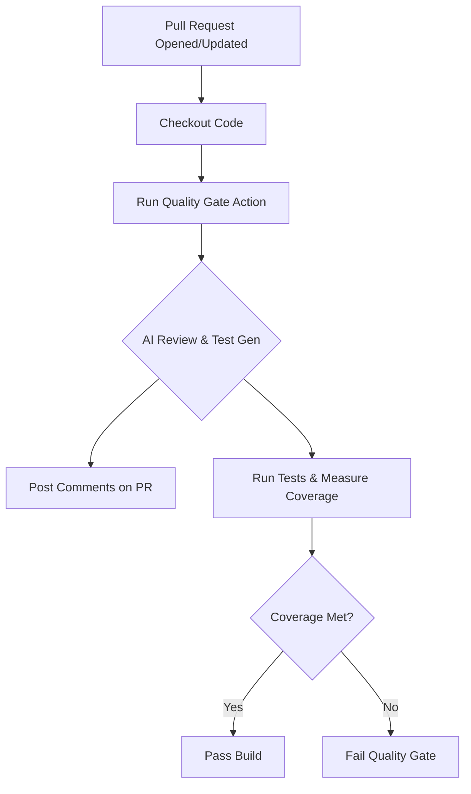

# Automated Quality Gate 🛡️🤖

[](https://github.com/marketplace/actions/automated-quality-gate)
[](https://opensource.org/licenses/MIT)

**Automated Quality Gate** is a GitHub Action powered by Google Gemini AI that automates code review, generates missing test suites, and enforces code quality standards (including coverage gates) directly on your Pull Requests.

---

## Features ✨

- 🔍 **AI-Powered Code Review**: Scans modified files in a PR and posts detailed constructive feedback directly as PR comments.
- 🧪 **Automated Test Generation**: Uses Gemini to analyze code and generate unit tests automatically to meet target code coverage metrics.
- 🚦 **Configurable Quality Gates**: Specify global and file-specific coverage targets to block PRs from merging if requirements aren't met.
- 🦊 **Extensible Integration**: Supports optional SonarCloud integration for comprehensive code quality gates.

---

## How It Works 🛠️



---

## Quick Start 🚀

To make this action available to others or to use it in any repository, follow these three simple steps:

### 1. Configure Repository Secrets

Add the following API key as a secret in the target repository's **Settings > Secrets and variables > Actions > New repository secret**:

| Secret Name | Description | Required |
| :--- | :--- | :--- |
| `GEMINI_API_KEY` | Your Google Gemini API Key | **Yes** |
| `SONAR_TOKEN` | Your SonarCloud authentication token | No |

---

### 2. Create the Workflow File

Create a file named `.github/workflows/quality-gate.yml` in your target repository and paste the following content:

```yaml
name: Quality Gate and AI Review

on:
  pull_request:
    types: [opened, synchronize, reopened]

jobs:
  quality-gate:
    name: Code Quality and AI Review
    runs-on: ubuntu-latest
    permissions:
      contents: read
      pull-requests: write # Required for posting comments on PRs

    steps:
      - name: Checkout Code
        uses: actions/checkout@v4

      - name: Setup Node.js
        uses: actions/setup-node@v4
        with:
          node-version: '20'

      - name: Install Dependencies
        run: npm ci

      - name: Run Quality Gate Action
        uses: NonnaritRammaneekultawat-6609650459/test-github-marketplace@v1.0.0
        with:
          gemini_api_key: ${{ secrets.GEMINI_API_KEY }}
          github_token: ${{ secrets.GITHUB_TOKEN }}
          # sonar_token: ${{ secrets.SONAR_TOKEN }} # Optional
```

---

### 3. (Optional) Define Coverage Goals in `config_cov.json`

To enforce custom coverage goals on specific files, create a `config_cov.json` file in the root of the project:

```json
{
  "global": 80,
  "files": {
    "src/math.js": 50,
    "src/utility.js": 60
  }
}
```

---

## Action Parameters 📝

### Inputs

| Parameter | Description | Required | Default |
| :--- | :--- | :--- | :--- |
| `gemini_api_key` | Google Gemini API Key | **Yes** | N/A |
| `github_token` | `GITHUB_TOKEN` for reading PR code and writing PR comments | **Yes** | `${{ github.token }}` |
| `sonar_token` | SonarCloud token (if using SonarQube integration) | No | N/A |

---

## License 📄

This project is licensed under the MIT License. See [LICENSE](LICENSE) for details.
